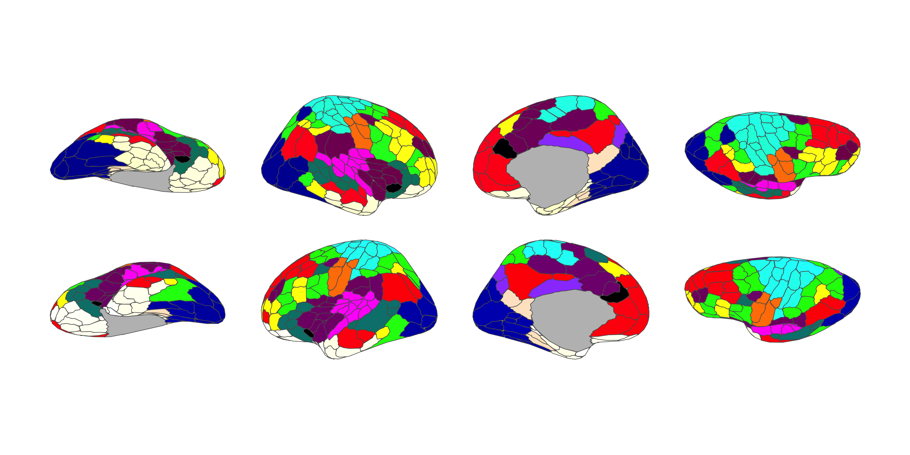

<!-- README.md is generated from README.qmd. Please edit that file -->

# ggsegGordon 

<!-- badges: start -->

[](https://github.com/ggsegverse/ggsegGordon/actions/workflows/R-CMD-check.yaml)
[](https://ggseg.r-universe.dev/ggsegGordon)
<!-- badges: end -->

This package contains dataset for plotting the Gordon atlas for ggseg.

Gordon EM, Laumann TO, Adeyemo B, Huckins JF, Kelley WM, & Petersen SE
(2016). Generation and evaluation of a cortical area parcellation from
resting-state correlations. *Cerebral Cortex*, 26(1), 288-303.

## Installation

We recommend installing the ggseg-atlases through the ggseg
[r-universe](https://ggseg.r-universe.dev/ui#builds):

``` r
options(repos = c(
  ggseg = "https://ggseg.r-universe.dev",
  CRAN = "https://cloud.r-project.org"
))

install.packages("ggsegGordon")
```

You can install this package from [GitHub](https://github.com/) with:

``` r
# install.packages("pak")
pak::pak("ggsegverse/ggsegGordon")
```

## Gordon atlas

``` r
library(ggseg)
library(ggsegGordon)
library(ggplot2)

ggplot() +
  geom_brain(
    atlas = gordon(),
    mapping = aes(fill = label),
    position = position_brain(hemi ~ view),
    show.legend = FALSE
  ) +
  scale_fill_manual(values = gordon()$palette, na.value = "grey") +
  theme_void()
```



## Data source

Gordon EM, Laumann TO, Adeyemo B, Huckins JF, Kelley WM, & Petersen SE
(2016). Generation and evaluation of a cortical area parcellation from
resting-state correlations. *Cerebral Cortex*, 26(1), 288-303.
